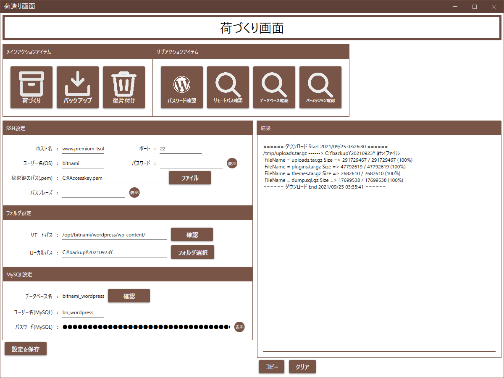

# MovingWordPress - ワードプレスの引っ越し屋さん

## リポジトリの説明

このリポジトリは、[プログラマーやめました](https://www.premium-tsubu-hero.net/)の人が作っています。
アプリケーション名は英名：MovingWordpress。和名：ワードプレスの引っ越し屋さんです。
ライセンスはWordPressの規約に従いGNU General Public License(GPLv2)を使用しています。

WordPress団体とは一切関係ありません。

## MovingWordPress

MovingWordPress(ワードプレスの引っ越し屋さん)は、
￥552(税込)という人が趣味でひっそり作っています。
紛らわしい名前ですが無料です。

MovingWordPress(ワードプレスの引っ越し屋さん)は、SSH経由で接続するサーバーのワードプレスを対象にバックアップ及び引っ越しを容易化することを目的としています。

更新頻度は不定期です。

## 使い方動画

https://www.youtube.com/watch?v=xGvn0l5z3WI

## ビルド

### 開発環境
- Microsoft Visual Studio Community 2019
- .NET 5.0

MovingWordpress.slnをVisual Studioで起動してリビルドすれば実行ファイルが出来上がります。

## コントリビュート

- [不具合の報告](https://github.com/zeikomi552/MovingWordpress/issues)

開発に協力したい方などいらっしゃいましたらご連絡ください。
どうやるのが正しいのか、まだわかっていませんが大歓迎です。

## ライセンス

Copyright (c) ￥552(税込)@プログラマーやめました. All rights reserved.

Licensed under the [GNU General Public License(GPLv2)](https://github.com/zeikomi552/MovingWordpress/blob/main/LICENSE)
